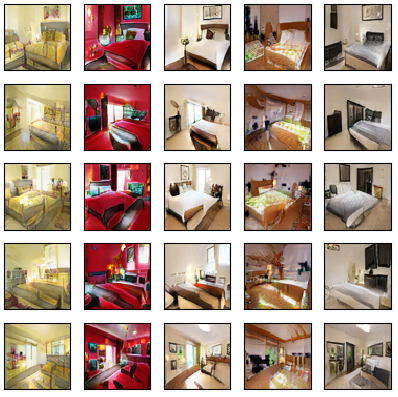
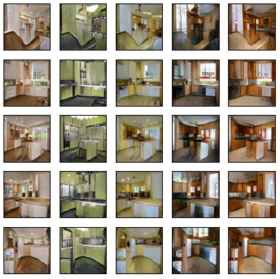
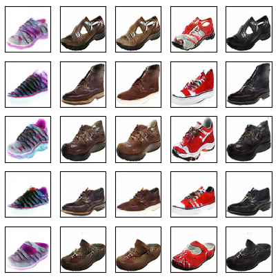

# Style and Content Disentanglement in Generative Adversarial Networks
A [PyTorch](http://pytorch.org/) implementation of [Style and Content Disentanglement in Generative Adversarial Networks](https://arxiv.org/abs/1811.05621) from the WACV 2019 paper by Hadi Kazemi, Seyed Mehdi Iranmanesh, and Nasser M. Nasrabadi.

Put all images of your dataset in a folder and set the address in SC-GAN.py.

## Results

Bedroom

Kitchen

Bags

Shoes

